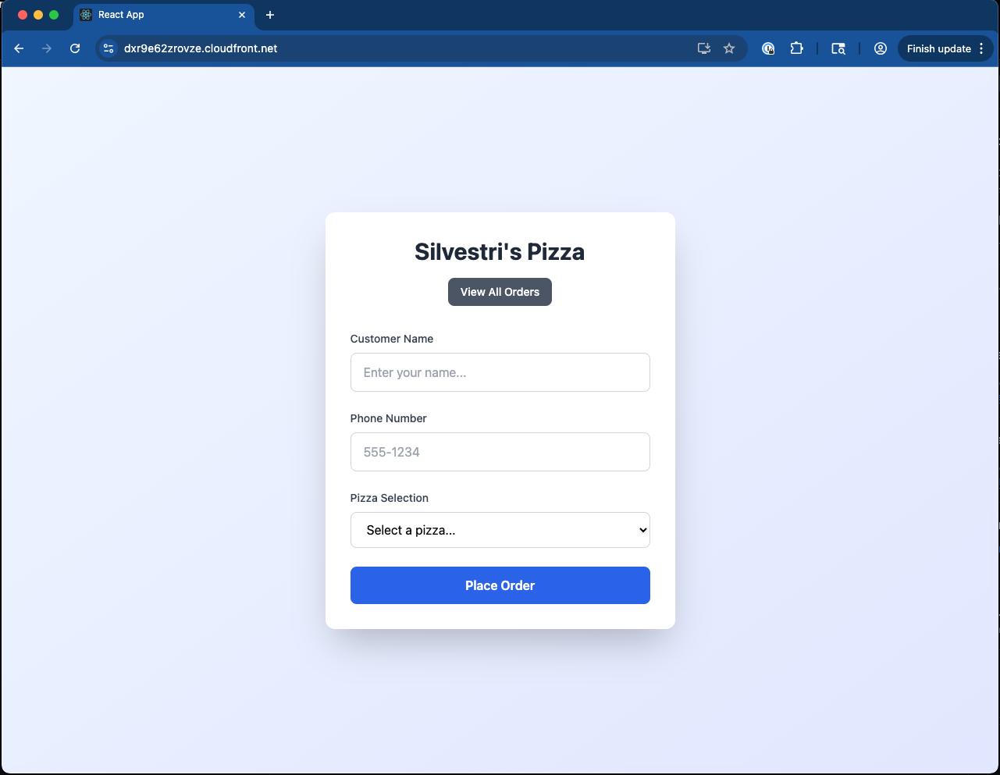
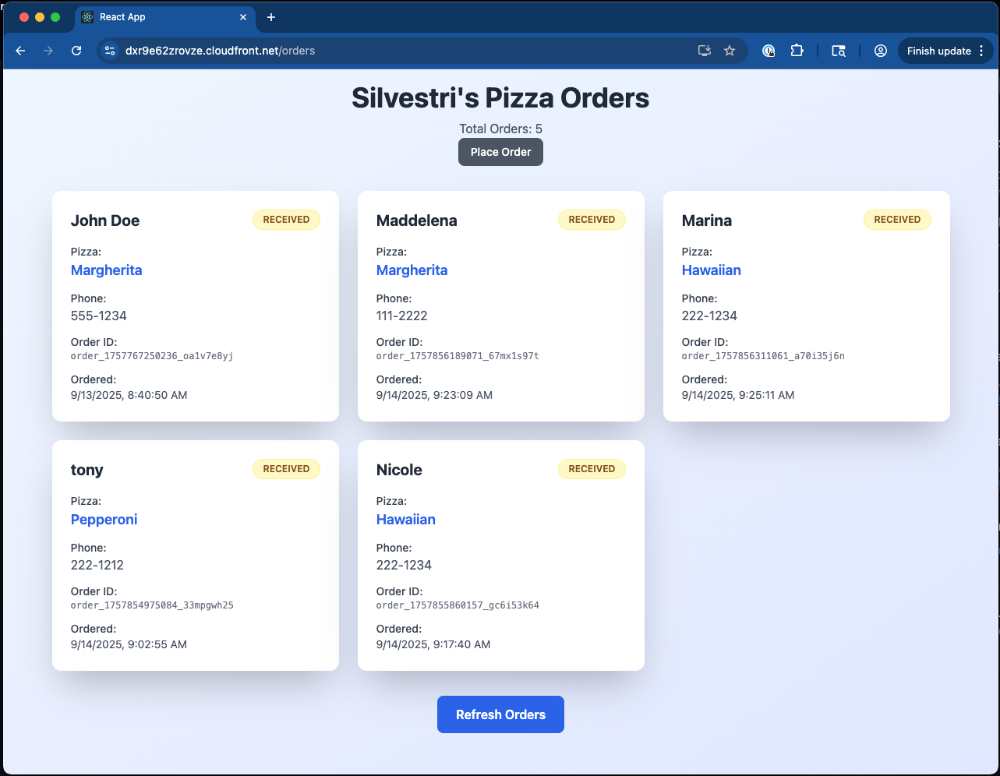

# React Hello World App

TypeScript React application with form submission to AWS Lambda backend. Built with Tailwind CSS for styling and React Hook Form for form handling.

## Architecture


## Overview

This app has a companion that sets up the infrastructure for this project: https://github.com/tsilvestri-slalom/proof-of-concept-cdk-infrastructure

Work through the README.md in this repo to get the infrastructure deployed. Then come back here to setup this React frontend.

## Features

- **POST Pizza Orders**: Submit your pizza order and persist it to a dynamo DB
- **GET Pizza Orders**: This page will make a GET request to get pizza orders and display them in a grid.
- **TypeScript**: Full type safety with interfaces for API responses
- **Tailwind CSS**: Modern styling with responsive design
- **React Hook Form**: Form validation and handling
- **Axios**: HTTP client for API requests
- **Environment-based API calls**: Different endpoints for development vs production




## Prerequisites

- Node.js (version 14 or later)
- AWS infrastructure deployed (see infrastructure repository)

## Outputs

When `cdk deploy` runs you will get a list of outputs that look like:
ReactAppStack.APIGatewayURL = https://xxxxxxxxxx.execute-api.us-east-1.amazonaws.com/prod/
ReactAppStack.CloudFrontURL = xxxxxxxxxxxxxx.cloudfront.net
ReactAppStack.DynamoDBTableName = pizza-orders-xxxxxxxxxxxx-us-east-1
ReactAppStack.LambdaFunctionName = ReactAppStack-ApiLambda91D2282D-xxxxxxxxxxxx
ReactAppStack.ReactAppApiEndpointE80AD34C = https://xxxxxxxxxx.execute-api.us-east-1.amazonaws.com/prod/
ReactAppStack.S3BucketName = react-app-bucket-xxxxxxxxxxxx-us-east-1

You can alwways run aws `cloudformation describe-stacks --stack-name ReactAppStack --query "Stacks[0].Outputs"` to get the same outputs.

## Setup

1. Install dependencies:

   ```bash
   npm install
   ```

2. Create environment file:

   ```bash
   touch .env
   ```

3. Add your API Gateway URL to `.env`:

   ```
   REACT_APP_API_URL=REACT_APP_API_URL=https://your-api-gateway-url-here
   ```

   Your .env file is used for local development.

- NOTE: there is an example .env file: `.env.example`
- NOTE: you will get the api gateway url when you run `cdk deploy` from your infrastructure repo. Alternatively run: `aws cloudformation describe-stacks --stack-name ReactAppStack --query "Stacks[0].Outputs"`


## Development

Start the development server:
```bash
npm start
```

The app will open at `http://localhost:3000` and make API calls to your deployed AWS API Gateway.

## Deployment

Build and deploy to AWS S3:

1. **Build the production app:**

   ```bash
   npm run build
   ```

2. **Upload to S3:**

   ```bash
   aws s3 sync build/ s3://your-bucket-name --delete
   ```

3. **Invalidate CloudFront cache:**

   ```bash
   aws cloudfront create-invalidation --distribution-id YOUR_DISTRIBUTION_ID --paths "/*"
   ```

### Automated Deployment

Rename `deploy.sh.example` -> `deploy.sh`. Edit the script to supply your s3 bucket and distribution ID.

```bash
#!/bin/bash
export REACT_APP_API_URL=ReactAppStack.APIGatewayURL-here
npm run build
aws s3 sync build/ s3://react-app-bucket-YOUR-ACCOUNT-ID-YOUR-REGION --delete
aws cloudfront create-invalidation --distribution-id YOUR_DISTRIBUTION_ID --paths "/*"
```

- NOTE: When your cdk deploy completes you'll need to grab:
`ReactAppStack.S3BucketName` and  replace the bucket (line 3) of the `deploy.sh` file. Alternatively run: `aws cloudformation describe-stacks --stack-name ReactAppStack --query "Stacks[0].Outputs"`
- NOTE: you will need to update the distribution-id (line 4) of the `deploy.sh` file as well. You can get that from the CloudFront service in the AWS console. Grab the most recent distribution-id.

Make it executable and run:

```bash
chmod +x deploy.sh
./deploy.sh
```

## API Configuration

The app uses conditional API endpoints:

- **Development**: Calls API Gateway directly via environment variable
- **Production**: Uses relative `/api` path (routed through CloudFront)

Update the API Gateway URL in your App.tsx after infrastructure changes:

```typescript
: 'https://new-api-id.execute-api.us-east-1.amazonaws.com/prod/api';
```

The API Gateway URL will be output when running `cdk deploy`. Grab `ReactAppStack.APIGatewayURL` and update your `apiUrl` in the else portion of the ternary and be sure to leave `/api` in the path.

## File Structure

```
├── public/
│   ├── index.html
│   └── ...
├── src/
│   ├── App.tsx          # Main component with form
│   ├── components/
│       ├── OrderForm.tsx
│       └── Orders.tsx
│   ├── App.css          # Tailwind styles
│   ├── index.tsx        # React entry point
│   └── index.css        # Tailwind imports
├── .env                 # Environment variables
├── package.json
└── tailwind.config.js   # Tailwind configuration
```

## Available Scripts

- `npm start` - Development server
- `npm run build` - Production build
- `npm test` - Run tests
- `npm run eject` - Eject from Create React App

## Dependencies

- **React 18+** with TypeScript
- **React Hook Form** - Form handling and validation
- **Axios** - HTTP requests
- **Tailwind CSS v3** - Styling framework

## Troubleshooting

**"No response received" error:**

- Check that your API Gateway URL is correct in the code
- Verify the AWS infrastructure is deployed
- Check browser network tab for actual error responses
- Ensure CORS is properly configured on the backend

**Styling not working:**

- Verify Tailwind CSS is properly installed and configured
- Check that `@tailwind` directives are in `src/index.css`
- Restart development server after Tailwind changes