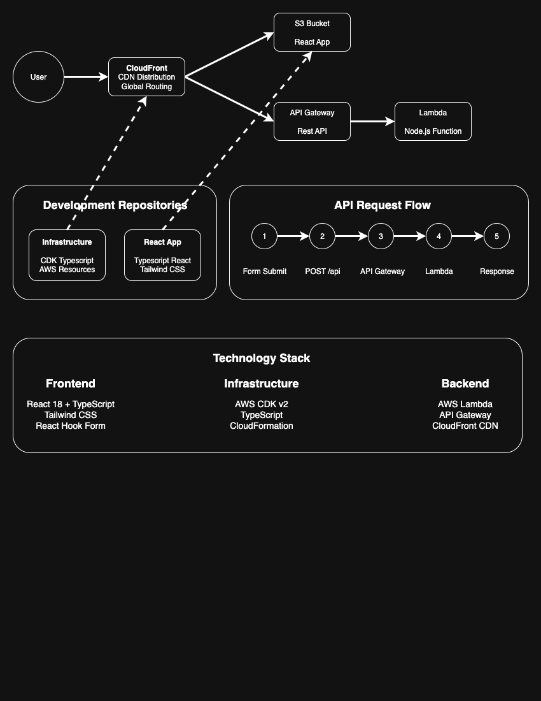

# React Hello World App

TypeScript React application with form submission to AWS Lambda backend. Built with Tailwind CSS for styling and React Hook Form for form handling.

## Architecture



## Features

- **Hello World Form**: Submit your name to get a personalized greeting
- **TypeScript**: Full type safety with interfaces for API responses
- **Tailwind CSS**: Modern styling with responsive design
- **React Hook Form**: Form validation and handling
- **Axios**: HTTP client for API requests
- **Environment-based API calls**: Different endpoints for development vs production

## Prerequisites

- Node.js (version 14 or later)
- AWS infrastructure deployed (see infrastructure repository)

## Setup

1. Install dependencies:
   ```bash
   npm install
   ```

2. Create environment file:
   ```bash
   touch .env
   ```

3. Add your API Gateway URL to `.env`:
   ```
   REACT_APP_API_URL=https://your-api-id.execute-api.us-east-1.amazonaws.com/prod
   ```

## Development

Start the development server:
```bash
npm start
```

The app will open at `http://localhost:3000` and make API calls to your deployed AWS API Gateway.

## Deployment

Build and deploy to AWS S3:

1. **Build the production app:**
   ```bash
   npm run build
   ```

2. **Upload to S3:**
   ```bash
   aws s3 sync build/ s3://your-bucket-name --delete
   ```

3. **Invalidate CloudFront cache:**
   ```bash
   aws cloudfront create-invalidation --distribution-id YOUR_DISTRIBUTION_ID --paths "/*"
   ```

### Automated Deployment

Edit the `deploy.sh` script:
```bash
#!/bin/bash
npm run build
aws s3 sync build/ s3://react-app-bucket-YOUR-ACCOUNT-ID-YOUR-REGION --delete
aws cloudfront create-invalidation --distribution-id YOUR_DISTRIBUTION_ID --paths "/*"
```

NOTE: When your cdk deploy completes you'll need to grab:
`ReactAppStack.S3BucketName` and  replace the bucket (line 3) of the `deploy.sh` file
NOTE: you will need to update the distribution-id (line 4) of the `deploy.sh` file as well. You can get that from the CloudFormation service in the AWS console. Grab the most recent distribution-id.

Make it executable and run:
```bash
chmod +x deploy.sh
./deploy.sh
```

## API Configuration

The app uses conditional API endpoints:

- **Development**: Calls API Gateway directly via environment variable
- **Production**: Uses relative `/api` path (routed through CloudFront)

Update the API Gateway URL in your App.tsx after infrastructure changes:
```typescript
: 'https://new-api-id.execute-api.us-east-1.amazonaws.com/prod/api';
```
The API Gateway URL will be output when running `cdk deploy`. Grab `ReactAppStack.APIGatewayURL` and update your `apiUrl` in the else portion of the ternary and be sure to leave `/api` in the path.

## File Structure

```
├── public/
│   ├── index.html
│   └── ...
├── src/
│   ├── App.tsx          # Main component with form
│   ├── App.css          # Tailwind styles
│   ├── index.tsx        # React entry point
│   └── index.css        # Tailwind imports
├── .env                 # Environment variables
├── package.json
└── tailwind.config.js   # Tailwind configuration
```

## Available Scripts

- `npm start` - Development server
- `npm run build` - Production build
- `npm test` - Run tests
- `npm run eject` - Eject from Create React App

## Dependencies

- **React 18+** with TypeScript
- **React Hook Form** - Form handling and validation
- **Axios** - HTTP requests
- **Tailwind CSS v3** - Styling framework

## Troubleshooting

**"No response received" error:**
- Check that your API Gateway URL is correct in the code
- Verify the AWS infrastructure is deployed
- Check browser network tab for actual error responses
- Ensure CORS is properly configured on the backend

**Styling not working:**
- Verify Tailwind CSS is properly installed and configured
- Check that `@tailwind` directives are in `src/index.css`
- Restart development server after Tailwind changes